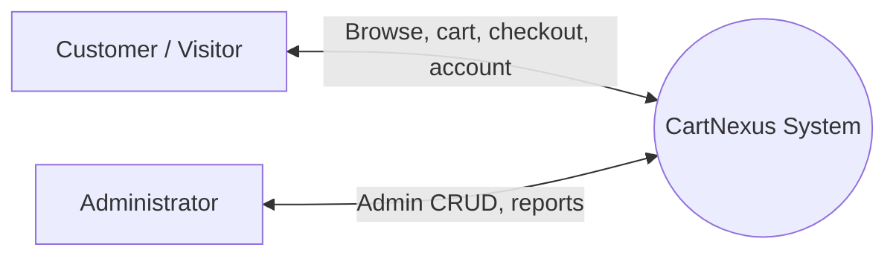
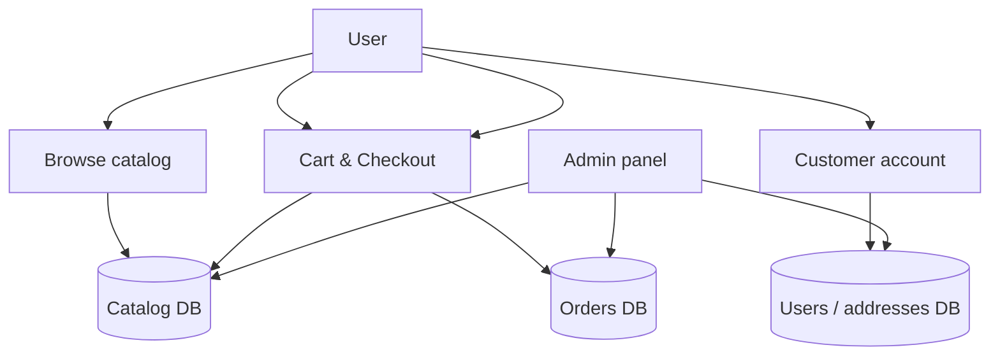
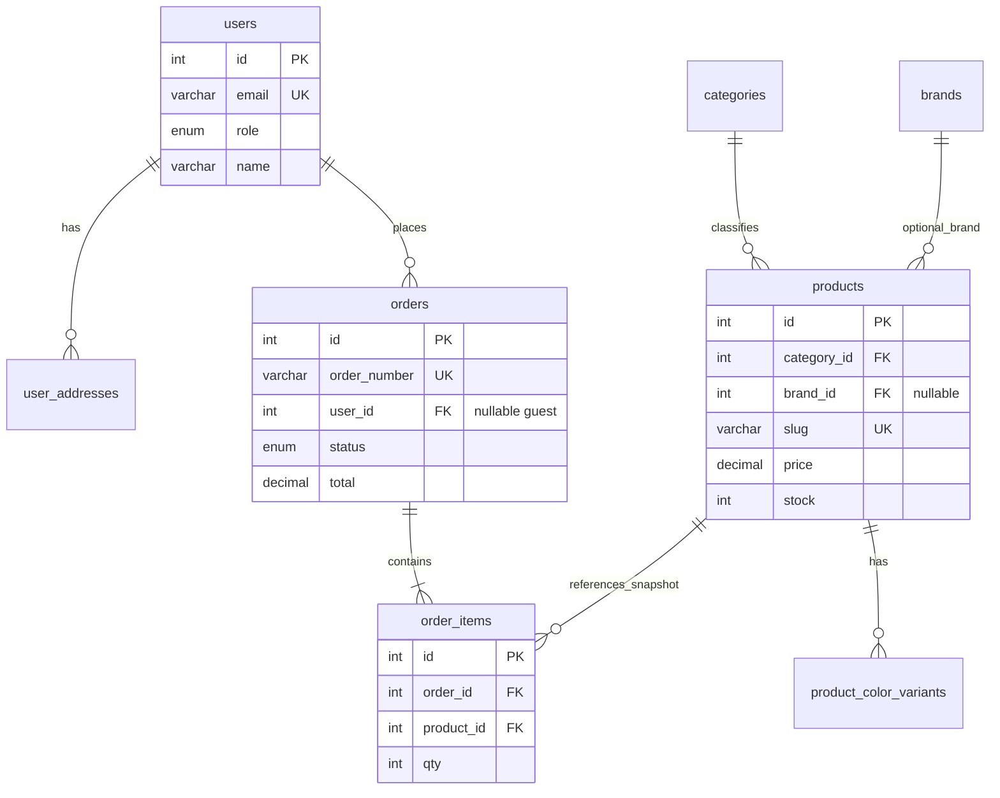

# CartNexus — Extended Project Documentation

**Document type:** Project overview & technical summary  
**Version:** 1.0  
**Last updated:** 2026-04-09  

---

## 1. Project Overview

### 1.1 Project Name

**CartNexus — Men’s Fashion E‑Commerce Platform**

### 1.2 Objective

To deliver a bilingual (English / Bangla) web application where customers can browse men’s fashion products by category and brand, manage a shopping cart, complete checkout with delivery details, optionally use a customer account (profile, addresses, order history), and where administrators can manage catalog, orders, inventory, marketing content (home hero, blog, CMS pages), and storefront configuration (contacts, social links, WhatsApp/Messenger).

### 1.3 Team Members

| Name | Student ID |
|------|------------|
| Md. Rabiul Isalam | 222002068 |
| Ahrafun Nahar Arifa | 222002066 |
| Hasebul Hasan | 221002104 |
| Labib Tahmid | 221002269 |
| Zinedin Hassan Choudhury | 222002148 |

**Institution:** NextTech Limited — Department of Computer Science and Engineering (CSE)  
**Batch:** 26/220 · **Internship title:** E-Commerce Website · **Supervisor:** Mobasser Ahmed  

---

## 2. UI/UX Design

### 2.1 Homepage

- **Header:** Logo, primary navigation (Shop, Categories, Brands, Blog, About, Contact), language toggle (EN/BN), search entry, cart badge, account menu.
- **Hero:** Full-width carousel driven by `home_hero` API — headline/subtext (EN/BN), CTA, gradient overlay, optional dual images.
- **Below the fold:** Category tiles, brand tiles, featured product sections (e.g. hot / latest), promotional blocks, trust/USP section, footer with quick links, newsletter, social icons from store settings, floating support (WhatsApp / Messenger).

**UX goals:** Fast scan of categories and brands; clear path to `/shop`; consistent teal/ink brand palette; responsive grid.

### 2.2 Product Page (`/shop/:slug`)

- **Gallery:** Main image + thumbnails; variant selection updates image/stock when color variants exist.
- **Details:** Title (EN/BN), price, compare-at price, size or variant picker, structured description sections from admin.
- **Actions:** Add to cart with quantity; sticky or prominent CTA on mobile.
- **Related:** Same category / brand suggestions where implemented.

**UX goals:** Variant and stock clarity; minimal steps to add to cart; readable bilingual content.

### 2.3 Checkout Design (`/checkout`)

- **Cart summary:** Line items with image, name, qty, line total; delivery zone selection with fee preview.
- **Customer block:** Name, phone, address fields; optional login hint for returning users.
- **Payment:** COD / recorded method selection aligned with backend `payment_method`.
- **Submit:** Clear total (subtotal + delivery); success redirect to `/checkout/success` with order acknowledgement.

**UX goals:** Single-column flow on mobile; error feedback on validation; trust signals (order summary).

---

## 3. Wireframe* (Basic Layout & Page Structure)

*Low-fidelity structural sketches — not pixel-perfect designs.*

### 3.1 Homepage (desktop)

```
┌─────────────────────────────────────────────────────────────┐
│ [Logo]  Nav links          [Search]  [Lang] [Cart] [User] │
├─────────────────────────────────────────────────────────────┤
│                                                             │
│              HERO (carousel / headline / CTA)               │
│                                                             │
├─────────────────────────────────────────────────────────────┤
│  Category tiles          │  Brand tiles                     │
├──────────────────────────┴──────────────────────────────────┤
│  Product grid (featured / hot / new)                        │
├─────────────────────────────────────────────────────────────┤
│  Promo / trust section                                      │
├─────────────────────────────────────────────────────────────┤
│  FOOTER: links | Stay connected | Newsletter                │
└─────────────────────────────────────────────────────────────┘
                                      [ Scroll top ] [ Support ]
```

### 3.2 Product Page

```
┌──────────────────────────┬──────────────────────────────────┐
│  [img] [thumb][thumb]    │  Title (EN/BN)                   │
│                          │  Price / compare                 │
│                          │  Variant / qty                 │
│                          │  [ Add to cart ]               │
├──────────────────────────┴──────────────────────────────────┤
│  Tabs / sections: description, specs                        │
├─────────────────────────────────────────────────────────────┤
│  Related products                                             │
└─────────────────────────────────────────────────────────────┘
```

### 3.3 Checkout

```
┌─────────────────────────────────────────────────────────────┐
│  Checkout                                     [Cart link]    │
├───────────────────────────────┬─────────────────────────────┤
│  Delivery & contact form      │  Order summary             │
│  Zone | Name | Phone | Addr   │  Lines + fees + total       │
│  Payment method               │  [ Place order ]           │
└───────────────────────────────┴─────────────────────────────┘
```

### 3.4 Admin shell (sidebar)

```
┌───────┬──────────────────────────────────────────────────────┐
│ Side  │  Toolbar / title                                      │
│ nav   ├──────────────────────────────────────────────────────┤
│       │  Main content (tables, forms, charts)               │
│       │                                                       │
└───────┴──────────────────────────────────────────────────────┘
```

---

## 4. DFD (Data Flow Diagram)

### 4.1 Level 0 — Context



### 4.2 Level 1 — Major flows



**Interpretation:** Users read catalog data; checkout writes orders; accounts maintain users and addresses; admin reads/writes all relevant stores.

---

## 5. Use Case Diagram

### 5.1 Diagram

```mermaid
flowchart TB
  subgraph Customer
    UC1[Browse products]
    UC2[Search / filter]
    UC3[Manage cart]
    UC4[Checkout]
    UC5[Register / Login]
    UC6[Manage profile & addresses]
    UC7[View order history]
    UC8[Read blog / CMS pages]
  end

  subgraph Admin
    UC10[Manage catalog]
    UC11[Manage orders]
    UC12[Manage inventory]
    UC13[Manage users]
    UC14[Configure hero / blog / CMS]
    UC15[Store settings]
    UC16[View dashboard analytics]
  end

  Guest([Guest]) --> UC1
  Guest --> UC2
  Guest --> UC3
  Guest --> UC4
  Guest --> UC8

  Cust([Customer]) --> UC1
  Cust --> UC2
  Cust --> UC3
  Cust --> UC4
  Cust --> UC5
  Cust --> UC6
  Cust --> UC7
  Cust --> UC8

  Adm([Admin]) --> UC10
  Adm --> UC11
  Adm --> UC12
  Adm --> UC13
  Adm --> UC14
  Adm --> UC15
  Adm --> UC16
```



### 5.2 Summary Table

| Actor | Main use cases |
|-------|----------------|
| **Guest** | Browse, search, cart, checkout (guest), static/blog content |
| **Customer** | Same + account, addresses, orders |
| **Admin** | Full back office: catalog, orders, inventory, users, content, settings, analytics |

---

## 6. Database Design

### 6.1 ER Diagram (core entities)



### 6.2 Core Tables (summary)

**User domain**

| Table | Purpose |
|-------|---------|
| `users` | Accounts: email, password hash, role (`admin` / `customer`), name, phone, avatar. |
| `user_addresses` | Saved delivery addresses per user. |

**Product domain**

| Table | Purpose |
|-------|---------|
| `categories` | Category names (EN/BN), slug, layout, cover. |
| `brands` | Brand names (EN/BN), slug, cover. |
| `products` | Catalog items: FK to category/brand, pricing, stock, descriptions, JSON sections. |
| `product_color_variants` | Optional per-color images and stock. |

**Order domain**

| Table | Purpose |
|-------|---------|
| `orders` | Order header: customer snapshot, delivery zone/fee, totals, status, optional `user_id`. |
| `order_items` | Line items with product snapshot and optional variant info. |

*Additional tables in production schema:* inventory movements, blog posts, CMS pages, `home_hero`, `store_settings`, admin task completions — see `backend/db/schema.sql`.

---

## 7. Features List

| Area | Features |
|------|-----------|
| **Catalog** | Categories, brands, filters, search, product detail, variants, stock display |
| **Cart** | Client-side cart context, qty updates, persist in browser session |
| **Checkout** | Guest/customer checkout, delivery zones & fees, order creation |
| **Auth** | Register/login, JWT, customer profile & avatar upload |
| **Account** | Addresses CRUD, order list |
| **Payments** | COD-style method recording; PSP integration out of scope for core |
| **Admin** | Dashboard, products/categories/brands, orders, inventory, users, hero, blog, CMS, store settings |
| **Content** | Blog, legal/info pages from DB when present |
| **i18n** | EN/BN UI and bilingual product/content fields |
| **Realtime** | Admin WebSocket refresh hooks after orders |
| **SEO / meta** | React Helmet usage on pages for titles/descriptions (see §9) |

---

## 8. Technology Stack

| Layer | Technology |
|-------|------------|
| **Frontend** | React 18, Vite 6, React Router 7, Tailwind CSS 3, Framer Motion, i18next, Recharts (admin charts), TipTap (admin rich text where used) |
| **Backend** | Node.js (ESM), Express 4, `mysql2`, `jsonwebtoken`, `bcrypt`, `multer`, `ws` (WebSocket), `cors`, `dotenv` |
| **Database** | MySQL 8+ (`utf8mb4`) |
| **Dev / quality** | Backend smoke script: `npm run test:smoke` (requires running API) |

---

## 9. SEO Plan

### 9.1 Keywords (examples)

**Primary:** men’s fashion Bangladesh, online clothing shop BD, men’s shirts online, CartNexus  
**Secondary:** branded menswear, sneakers BD, grooming products men, Dhaka delivery  

Align keywords with category/brand slugs and blog post keywords stored in admin.

### 9.2 Meta Tags (pattern)

- **Home:** `<title>` — brand + value prop; `<meta name="description">` — 150–160 chars, EN primary; optional BN alternate via `hreflang` if expanded.
- **Product:** Dynamic title: `{Product name} | CartNexus`; description from short description or truncated `description_en`.
- **Blog:** Post title + excerpt in meta; Open Graph `og:title`, `og:description`, `og:image` when `image_url` present.

Implementation note: project uses `react-helmet-async` — ensure each route sets unique title/description.

### 9.3 URL Structure

| Pattern | Purpose |
|---------|---------|
| `/` | Home |
| `/shop` | Catalog listing |
| `/shop/:slug` | Product detail |
| `/categories`, `/categories/:slug` | Categories & filtered listing |
| `/brands`, `/brands/:slug` | Brands & filtered listing |
| `/blog`, `/blog/:slug` | Blog |
| `/checkout`, `/checkout/success` | Checkout funnel |
| Static: `/about`, `/contact`, `/terms`, `/privacy`, `/faqs` | Trust & support |

**Guidelines:** Lowercase slugs; hyphen-separated; canonical URLs on duplicate filters if introduced later.

---

## 10. Testing Report

### 10.1 Scope

| Type | Method |
|------|--------|
| **API smoke** | `cd backend && npm run test:smoke` — health, public endpoints, admin JWT paths (configure base URL / token per script) |
| **Manual UI** | Browse shop, cart, checkout, admin flows after deploy |
| **Performance (informal)** | Lighthouse / Network tab on category and product pages |

### 10.2 Sample Log (template — fill with real runs)

| Date | Area | Issue | Severity | Fix / status |
|------|------|-------|----------|--------------|
| YYYY-MM-DD | Checkout | Example: validation message unclear | Low | Copy updated |
| YYYY-MM-DD | API | Example: 503 when migration missing | Med | Run `migration_*.sql` |

### 10.3 Performance Check (checklist)

- [ ] First contentful paint acceptable on 3G simulated home page  
- [ ] Product images lazy-loaded where implemented  
- [ ] API responses < 500 ms typical on LAN for catalog list  
- [ ] No console errors on happy-path checkout  

*Replace checklist results with measurements after formal testing.*

---

## 11. Deployment Info

### 11.1 Build & Run

**Frontend**

```bash
cd frontend
npm ci
npm run build
# Output: frontend/dist — serve via static host or reverse proxy to `/`
```

**Backend**

```bash
cd backend
npm ci
# Configure .env: MYSQL_*, JWT_SECRET, PORT
npm start
```

### 11.2 Environment

| Variable | Role |
|----------|------|
| `MYSQL_HOST`, `MYSQL_PORT`, `MYSQL_USER`, `MYSQL_PASSWORD`, `MYSQL_DATABASE` | DB connection |
| `JWT_SECRET` | Token signing |
| `PORT` | API port (default 5000) |
| Frontend `VITE_API_URL` | Absolute API URL when SPA not proxied |

### 11.3 Production Checklist

- HTTPS termination (nginx / cloud LB)  
- MySQL backups  
- `.env` secrets not committed  
- Run all `db/migration_*.sql` / align with `schema.sql`  
- Uploads directory persisted (`backend/uploads`)  
- Optional: PM2 / systemd for Node process  

---

## 12. Team Contribution

*Assign concrete tasks per member based on actual project work — below is a suggested split for documentation purposes; **edit to match reality**.*

| Team member | ID | Suggested contribution areas |
|-------------|-----|------------------------------|
| Md. Rabiul Isalam | 222002068 | Backend API routes, orders, deployment scripts |
| Ahrafun Nahar Arifa | 222002066 | UI components, Tailwind styling, homepage |
| Hasebul Hasan | 221002104 | Database schema, ER modeling, migrations |
| Labib Tahmid | 221002269 | Admin panel, dashboard, inventory features |
| Zinedin Hassan Choudhury | 222002148 | Cart/checkout flow, testing, documentation |

---

## Revision History

| Ver | Date | Notes |
|-----|------|-------|
| 1.0 | 2026-04-09 | Initial extended documentation |

---

*End of document.*
