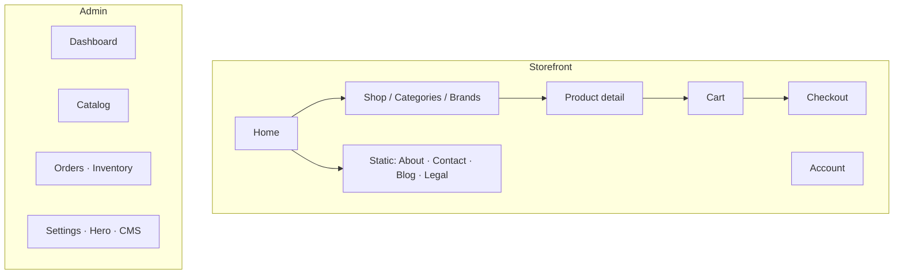

# CartNexus — UI/UX Design Specification

**Version:** 1.0  
**Product:** CartNexus (men’s fashion e-commerce)  
**Stack (UI):** React, Tailwind CSS, i18next (EN / BN)  
**Purpose:** Single source of truth for look, feel, and interaction patterns for the public site and admin.

---

## 1. Design principles


| Principle                 | Application in CartNexus                                                                                    |
| ------------------------- | ----------------------------------------------------------------------------------------------------------- |
| **Clarity first**         | Large product imagery, readable prices, obvious primary actions (Shop, Add to cart, Checkout).              |
| **Trust & polish**        | Consistent teal brand accent on dark/light sections; editorial hero on home; legal/footer links.            |
| **Bilingual parity**      | UI strings and product copy support EN/BN via i18next; layouts allow longer Bangla labels without clipping. |
| **Mobile-first commerce** | Touch targets ≥ ~44px; sticky header where used; checkout as a vertical flow.                               |
| **Feedback**              | Loading states, cart badge updates, error messages on forms; admin tables show save/error.                  |


---

## 2. Design system

### 2.1 Colour palette

Derived from `tailwind.config.js`.


| Role                       | Token / hex            | Usage                                                                            |
| -------------------------- | ---------------------- | -------------------------------------------------------------------------------- |
| **Brand primary**          | `brand-600` `#0d9488`  | Links, active nav, CTA fills, focus rings.                                       |
| **Brand hover / emphasis** | `brand-500` `#14b8a6`  | Button hover, highlights.                                                        |
| **Brand soft bg**          | `brand-50`–`brand-100` | Badges, hover rows, chip backgrounds.                                            |
| **Ink / dark UI**          | `ink-950` `#0c0f14`    | Default page background (storefront shell).                                      |
| **Ink elevated**           | `ink-900`              | Cards, nav strip on dark pages.                                                  |
| **Neutrals**               | `slate-`*              | Body text, borders, muted labels on light sections (e.g. footer `slate-100` bg). |
| **Success / live**         | Emerald accents        | Positive toasts, “online” indicators (e.g. support dot).                         |


**Rule:** On **dark** backgrounds use **white / slate-100** text; on **light** footers use **ink / slate-800** text. Brand teal bridges both.

### 2.2 Typography


| Role                   | Font    | Tailwind            |
| ---------------------- | ------- | ------------------- |
| **Display / headings** | Outfit  | `font-display`      |
| **Body & UI**          | DM Sans | default `font-sans` |


**Scale (reference):**

- Hero headline: `text-2xl` → `lg:text-[2.35rem]` (home hero).
- Section titles: `text-xl`–`text-2xl` `font-semibold`.
- Body: `text-sm`–`text-base`, `leading-relaxed` for long Bangla lines.

### 2.3 Spacing & layout

- **Page horizontal padding:** `px-[20px]` (project convention) for alignment with header/footer.
- **Section vertical rhythm:** `py-14`–`py-20` for major sections.
- **Card radius:** `rounded-xl`–`rounded-2xl` for cards, inputs, modals.
- **Max content width:** Grids use `max-w-`* / `lg:grid-cols-*` so lines don’t exceed ~65–75 characters where readable.

### 2.4 Components (patterns)


| Component             | Behaviour                                                                                 |
| --------------------- | ----------------------------------------------------------------------------------------- |
| **Primary button**    | Rounded pill or `rounded-xl`, `bg-brand-600`, white text, hover `brand-500`.              |
| **Secondary / ghost** | Border `white/40` or `slate-300`, transparent or subtle fill.                             |
| **Product card**      | Image top, title, price; hover lift or border tint; link wraps whole card where possible. |
| **Inputs**            | `rounded-xl`, clear focus ring `ring-brand-500/20`, border `brand-500` on focus.          |
| **Admin sidebar**     | Dark panel, grouped nav sections, active item with brand tint + icon.                     |


---

## 3. Information architecture




---

## 4. Page-level UX

### 4.1 Home

**Goals:** Brand impact, discovery, push to `/shop`.


| Zone           | UX notes                                                                                                                                  |
| -------------- | ----------------------------------------------------------------------------------------------------------------------------------------- |
| **Header**     | Logo, primary nav, search, language toggle, cart count, account. Sticky behaviour as implemented.                                         |
| **Hero**       | Full-bleed carousel when multiple banner images; headline + sub + single CTA; arrows/dots for control; reduce motion respects OS setting. |
| **Below fold** | Category / brand tiles → product grids → promo / trust → footer newsletter & social.                                                      |


**Wireframe (desktop, conceptual)**

```
┌─────────────────────────────────────────────────────────┐
│ [Logo]  Nav · Search · BN/EN · Cart · Account             │
├─────────────────────────────────────────────────────────┤
│ FULL-WIDTH HERO (carousel) · headline · CTA             │
├─────────────────────────────────────────────────────────┤
│ [ Cat tile ] [ Cat tile ] [ Cat tile ] …                │
│ [ Brand ] [ Brand ] …                                    │
│ FEATURED PRODUCTS (grid)                                 │
│ FOOTER                                                   │
└─────────────────────────────────────────────────────────┘
```

### 4.2 Shop / listing (category & brand)

- **Filters:** Search, category/brand context, price/stock where applicable — collapsible on mobile.
- **Grid:** Responsive columns; consistent card height with image aspect ratio.
- **Empty state:** Friendly copy + link back to categories.

### 4.3 Product detail

- **Gallery:** Main image + thumbs; switching variant updates image and availability.
- **Buy box:** Price, compare-at, variant selector, quantity, clear **Add to cart**.
- **Trust:** Delivery hint, return/refund if you add later; link to size guide optional.

### 4.4 Cart

- Line items with thumbnail, title, qty stepper, remove.
- Sticky summary on desktop; stacked on mobile.
- Clear path to **Checkout**; show delivery note if cart empty.

### 4.5 Checkout

- Single-column stack on mobile: contact → address → zone/fee → payment (COD).
- Order summary **always visible** on desktop (sidebar); accordion summary on small screens optional.
- Success page: order number, expectation-setting copy, link to shop/account.

### 4.6 Account

- Dashboard cards for orders / profile shortcuts.
- Orders list with status chips (colour-coded: pending → delivered).

### 4.7 Footer & support

- Quick links grid; newsletter; social from store settings; floating support (WhatsApp / Messenger) per settings.

---

## 5. Admin UI

**Goals:** Density without clutter; fast scanning.


| Area                    | UX                                                                                          |
| ----------------------- | ------------------------------------------------------------------------------------------- |
| **Shell**               | Left sidebar navigation; main content scroll; tables sortable/filterable where implemented. |
| **Forms**               | Grouped sections, dark inputs on dark bg, explicit Save.                                    |
| **Dashboard**           | KPI cards + charts; optional realtime refresh cue.                                          |
| **Destructive actions** | Confirm before delete where applicable.                                                     |


Admin uses a **different visual tone** (dark chrome) to separate mentally from storefront.

---

## 6. States & accessibility


| State              | Treatment                                                                         |
| ------------------ | --------------------------------------------------------------------------------- |
| **Loading**        | Skeleton or spinner; avoid layout jump.                                           |
| **Error**          | Inline field errors + summary for checkout; API errors translated where possible. |
| **Empty cart**     | Illustration or icon + CTA to shop.                                               |
| **Reduced motion** | Respect `prefers-reduced-motion` for hero carousel auto-advance (when enabled).   |


**Accessibility checklist:** semantic headings, button `aria-label`s for icon-only controls, carousel labelled with `aria-roledescription`, sufficient contrast on primary buttons (white on brand-600).

---

## 7. Responsive breakpoints (Tailwind defaults)


| Breakpoint | Use                                          |
| ---------- | -------------------------------------------- |
| `sm`       | Two-column grids start; enlarge tap targets. |
| `md`       | Sidebar layouts, wider hero typography.      |
| `lg`       | Full marketing grids, footer columns.        |


---

## 8. Evolution roadmap (design)

1. Unified **component library doc** (Storybook optional) for buttons, inputs, cards.
2. **Design tokens** exported from Tailwind into Figma variables for designer handoff.
3. **Product listing** saved filters / URL sync for shareable searches.
4. **Checkout** progress stepper (Cart → Details → Confirm) if flow grows.

---

## 9. Related files in repo


| Area         | Path hints                                                 |
| ------------ | ---------------------------------------------------------- |
| Theme        | `frontend/tailwind.config.js`, `frontend/src/index.css`    |
| Shell        | `frontend/src/components/SiteHeader.jsx`, `SiteFooter.jsx` |
| Hero         | `frontend/src/components/home/HomeHeroBanner.jsx`          |
| Admin chrome | `frontend/src/pages/admin/AdminLayout.jsx`                 |


---

*This document describes the intended CartNexus UI/UX; implementation may vary slightly by route. Update this file when major visual patterns change.*