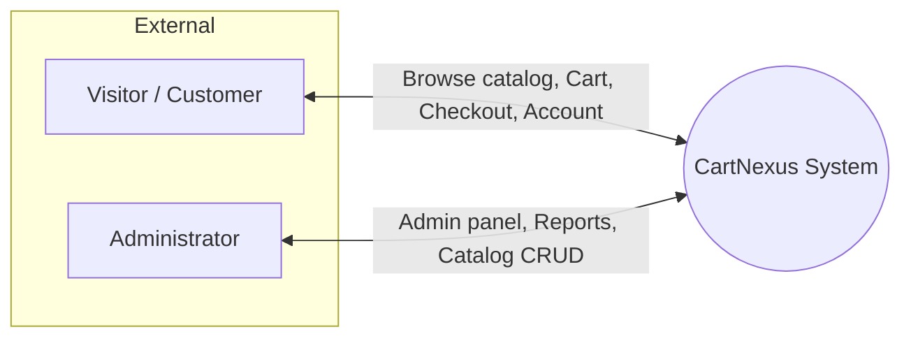
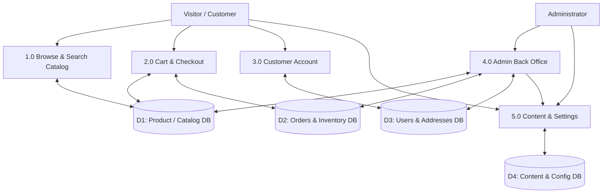
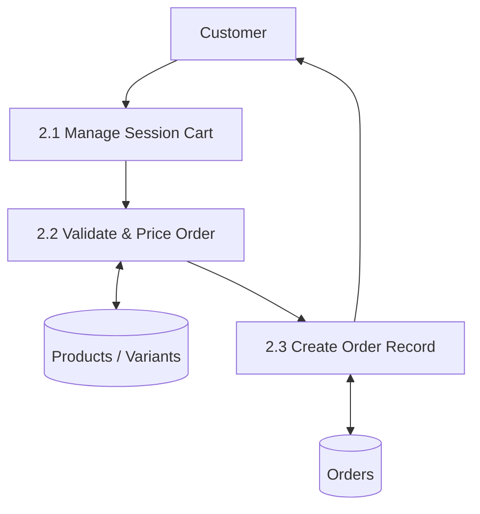
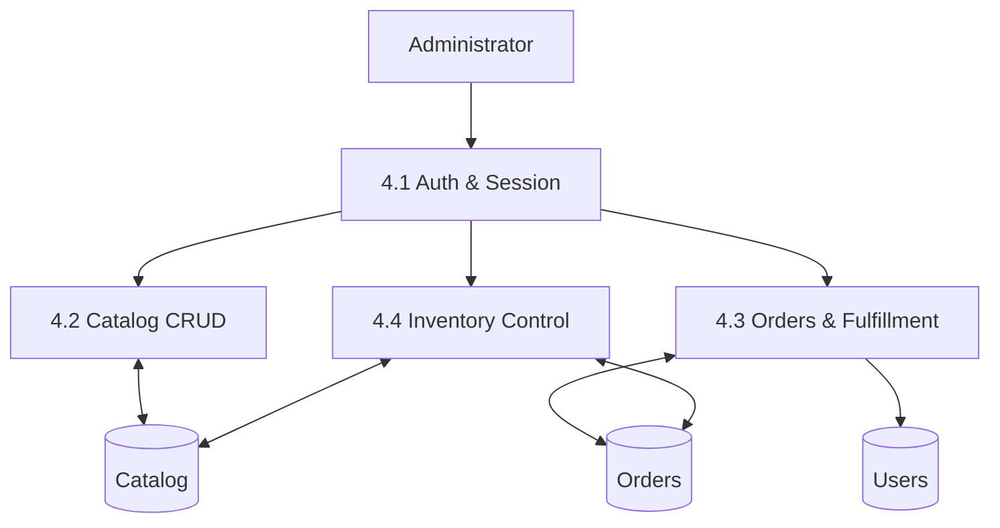
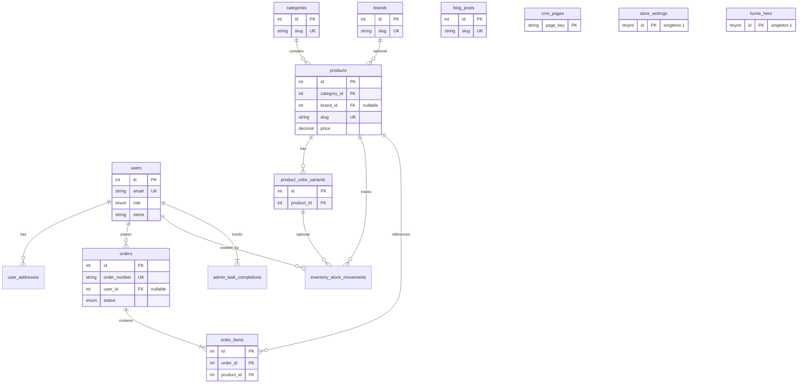
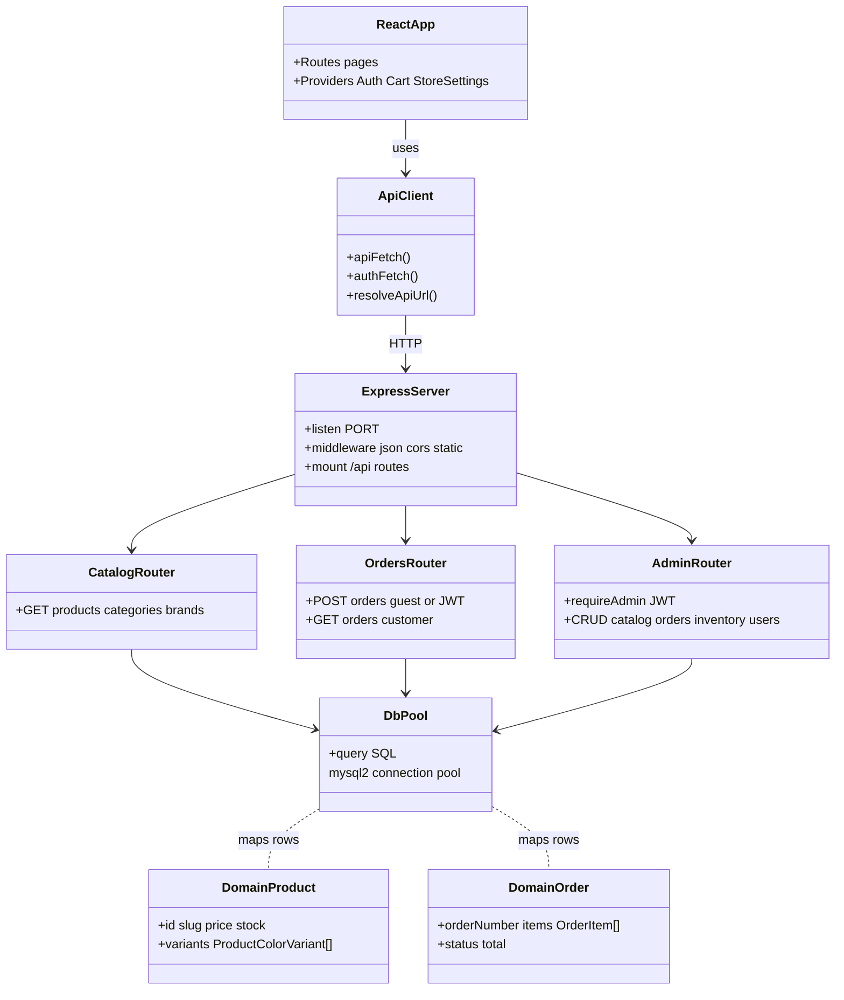

**NextTech Limited**

Department of Computer Science and Engineering (CSE)

Semester: (Spring, Year: 2026), B.Sc. in CSE (Day)

**>>** **nexttech** Ltd.

---

# CartNexus — Men’s Fashion E-Commerce Platform

---

**Internship Title:** E-Commerce Website

**Batch:** 26/220

++**Students Details**++

| Name                     | ID        |
| ------------------------ | --------- |
| Md. Rabiul Isalam        | 222002068 |
| Ahrafun Nahar Arifa      | 222002066 |
| Hasebul Hasan            | 221002104 |
| Labib Tahmid             | 221002269 |
| Zinedin Hassan Choudhury | 222002148 |

**Submission Date:** Mar 08, 2026

**Supervisor’s Name:** Mobasser Ahmed

For teachers use only: **Don’t write anything inside this box**

++**Lab Project Status**++

|                |     |
| -------------- | --- |
| **Marks:**     |     |
| **Signature:** |     |
| **Comments:**  |     |
| **Date:**      |     |

---

# Software Requirements Specification (SRS)

| Document    | Details                                |
| ----------- | -------------------------------------- |
| **Version** | 1.0                                    |
| **Date**    | 2026-04-09                             |
| **Project** | CartNexus                              |
| **Stack**   | React (Vite), Node.js (Express), MySQL |

---

## 1. Introduction

### 1.1 Purpose

This SRS defines functional and non-functional requirements, system context, data structures, and high-level design views (DFD levels 0–2, ERD, class diagram) for **CartNexus**, a bilingual (English / Bangla) online storefront with customer shopping flows, checkout, customer accounts, and an administrative back office.

### 1.2 Scope

**In scope**

- Product catalog discovery (categories, brands, search, filters).
- Product detail pages with optional color variants.
- Shopping cart (client-side state) and guest / registered checkout with COD-style payment recording.
- Customer registration, login, profile, saved addresses, order history.
- Admin: dashboard analytics, catalog (categories, brands, products), orders, inventory, users, home hero, blog, CMS pages (terms/privacy/faqs), store settings (contact, social, WhatsApp/Messenger).
- Public APIs and JSON responses; file uploads for avatars, catalog covers, hero images.
- Real-time admin dashboard refresh via WebSocket after new orders.

**Out of scope (current codebase)**

- Integrated payment gateways (card/mobile wallet) — checkout records `payment_method`; external PSP integration is future work.
- Native mobile apps (responsive web only).
- Multi-tenant / multiple stores in one deployment.

### 1.3 Definitions & Abbreviations

| Term    | Meaning                                        |
| ------- | ---------------------------------------------- |
| **SRS** | Software Requirements Specification            |
| **DFD** | Data Flow Diagram                              |
| **ERD** | Entity Relationship Diagram                    |
| **CMS** | Content Management (editable legal/info pages) |
| **COD** | Cash on delivery                               |
| **JWT** | JSON Web Token (auth)                          |

### 1.4 References

- Canonical DB: `backend/db/schema.sql`
- Change log: `backend/db/db-changelog.txt`

---

## 2. Overall Description

### 2.1 Product Perspective

CartNexus is a **three-tier** application:

1. **Presentation:** React SPA (`frontend/`), i18n (EN/BN).
2. **Application:** REST API + WebSocket (`backend/src/server.js`, routes under `/api`).
3. **Data:** MySQL (`cartnexus` database).

External actors: **Visitors/Customers**, **Administrators**. Optional: email/SMS providers (not hard-required in core).

### 2.2 User Classes

| User class   | Description                                                               |
| ------------ | ------------------------------------------------------------------------- |
| **Guest**    | Browse, add to cart, checkout without account (or with optional account). |
| **Customer** | Registered user: profile, addresses, orders.                              |
| **Admin**    | Full back-office access via JWT-protected `/api/admin/`*.                 |

### 2.3 Operating Constraints

- Node.js LTS, modern evergreen browsers.
- MySQL 8+ recommended; UTF-8 (`utf8mb4`).
- Environment variables for DB credentials, JWT secret, optional `VITE_API_URL`.

---

## 3. Functional Requirements

### 3.1 Storefront (FR-SF)

| ID       | Requirement                                                                                                 |
| -------- | ----------------------------------------------------------------------------------------------------------- |
| FR-SF-01 | Display home hero from `home_hero` (API).                                                                   |
| FR-SF-02 | List/filter products by category, brand, price, stock; product detail with variants when configured.        |
| FR-SF-03 | Shopping cart persisted in browser (context); quantities and variant selection.                             |
| FR-SF-04 | Checkout collects delivery data; creates order via `POST /api/orders`; supports guest or Bearer token.      |
| FR-SF-05 | Static/marketing pages: About, Contact (store settings), Blog, Terms/Privacy/FAQs (CMS API when available). |
| FR-SF-06 | Footer/store settings: social links, WhatsApp/Messenger FAB when configured.                                |

### 3.2 Customer Account (FR-CU)

| ID       | Requirement                                              |
| -------- | -------------------------------------------------------- |
| FR-CU-01 | Register, login, JWT session (storage).                  |
| FR-CU-02 | Profile (name, phone, avatar upload).                    |
| FR-CU-03 | CRUD addresses (`user_addresses`).                       |
| FR-CU-04 | List own orders (`GET /api/orders` with customer token). |

### 3.3 Administration (FR-AD)

| ID       | Requirement                                                                       |
| -------- | --------------------------------------------------------------------------------- |
| FR-AD-01 | JWT login; role `admin` required for `/api/admin/`*.                              |
| FR-AD-02 | Dashboard: revenue, orders, charts, tasks, suggestions (API-driven).              |
| FR-AD-03 | Manage categories, brands, products (including descriptions, variants, covers).   |
| FR-AD-04 | Manage orders (status updates); inventory adjustments and movement history.       |
| FR-AD-05 | Manage users (list, role); blog posts; CMS HTML pages; home hero; store settings. |
| FR-AD-06 | WebSocket subscription for dashboard refresh on relevant events.                  |

### 3.4 Data & Integration (FR-DT)

| ID       | Requirement                                                               |
| -------- | ------------------------------------------------------------------------- |
| FR-DT-01 | Public read APIs for catalog, blog, CMS pages, store settings, home hero. |
| FR-DT-02 | Uploaded files served under `/uploads/`*.                                 |
| FR-DT-03 | Orders immutable line items snapshot in `order_items`.                    |

---

## 4. Non-Functional Requirements

| ID     | Category        | Requirement                                                                                         |
| ------ | --------------- | --------------------------------------------------------------------------------------------------- |
| NFR-01 | Performance     | Catalog and product APIs paginated/filtered; avoid unbounded scans in admin lists.                  |
| NFR-02 | Security        | Password hashing (bcrypt); admin/customer JWT separation; HTTPS in production.                      |
| NFR-03 | Availability    | Graceful degradation if optional tables/features missing (503 with coded errors where implemented). |
| NFR-04 | i18n            | UI strings EN/BN; product/content bilingual fields where modeled.                                   |
| NFR-05 | Maintainability | Migrations + changelog for schema drift.                                                            |

---

## 5. Data Flow Diagrams (DFD)

### 5.1 Level 0 (Context Diagram)

Shows the system boundary and external interactions.

**Data flows (summary)**

- **Customer → System:** search/browse requests, cart actions, checkout payload, login credentials, profile updates.
- **System → Customer:** product/catalog data, order confirmation, auth tokens.
- **Admin → System:** CRUD operations, file uploads, configuration.
- **System → Admin:** analytics, lists, confirmations.

---

### 5.2 Level 1 DFD

Major processes inside CartNexus and shared data stores.

**Store grouping (logical)**

| Store  | Typical tables                                               |
| ------ | ------------------------------------------------------------ |
| **D1** | `categories`, `brands`, `products`, `product_color_variants` |
| **D2** | `orders`, `order_items`, `inventory_stock_movements`         |
| **D3** | `users`, `user_addresses`, `admin_task_completions`          |
| **D4** | `home_hero`, `blog_posts`, `cms_pages`, `store_settings`     |

---

### 5.3 Level 2 DFD (decomposition)

#### 5.3.1 Process 2.0 — Cart & Checkout (expanded)

#### 5.3.2 Process 4.0 — Admin Back Office (expanded)

---

## 6. Entity Relationship Diagram (ERD)

Core relationships aligned with `backend/db/schema.sql`. Cardinality in notes.

---

## 7. Class Diagram (Logical / Layered)

The codebase is primarily **JavaScript modules** (not Java-style classes everywhere). The diagram below captures **logical responsibilities** (UML-style) mapped to major folders.

---

## 8. Budget (Indicative)

Figures are **planning estimates** in **BDT** (Bangladesh Taka). Adjust for team rates, timeline, and hosting choice.

| Item                        | Description                                                                                                   | Low (BDT) | High (BDT)   |
| --------------------------- | ------------------------------------------------------------------------------------------------------------- | --------- | ------------ |
| **A. One-time development** | Design + storefront + admin + DB + deploy (already largely implemented; use for future phases or maintenance) | 200,000   | 800,000+     |
| **B. Domain & SSL**         | `.com` / `.bd` domain + TLS (often included with hosting)                                                     | 1,500     | 5,000 / yr   |
| **C. Hosting**              | VPS (2–4 GB RAM) or cloud VM for Node + MySQL                                                                 | 12,000    | 60,000 / yr  |
| **D. Database**             | Same VM or managed MySQL add-on                                                                               | 0         | 30,000 / yr  |
| **E. Storage & CDN**        | Product images on server or object storage                                                                    | 0         | 15,000 / yr  |
| **F. Email / SMS**          | Transactional email; optional OTP/SMS                                                                         | 0         | 24,000 / yr  |
| **G. Backup & monitoring**  | Automated DB backup, uptime                                                                                   | 0         | 12,000 / yr  |
| **H. Maintenance**          | Small fixes, dependency updates, minor features (optional retainer)                                           | 30,000    | 120,000 / yr |

**Rough first-year total (excluding large new features):** **~55,000 – 250,000 BDT** recurring + variable dev.

---

## 9. Revision History

| Version | Date       | Notes                                                |
| ------- | ---------- | ---------------------------------------------------- |
| 1.0     | 2026-04-09 | Initial SRS with DFD 0–2, ERD, class diagram, budget |

---

